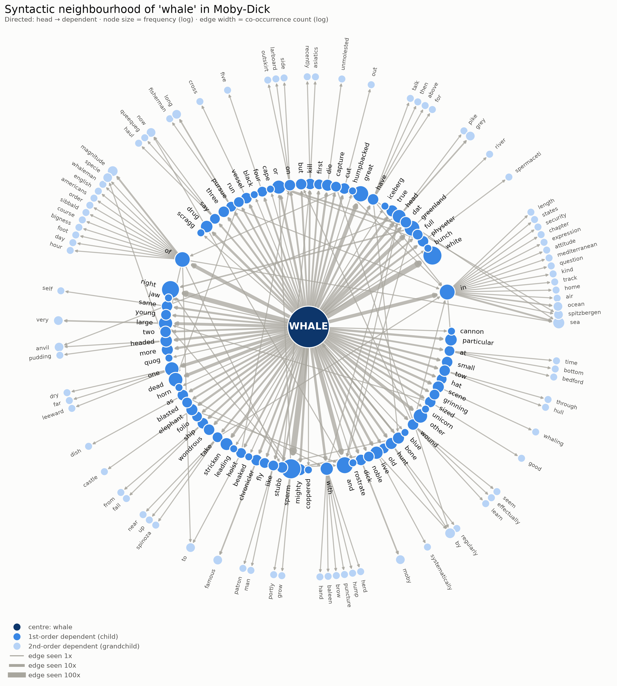
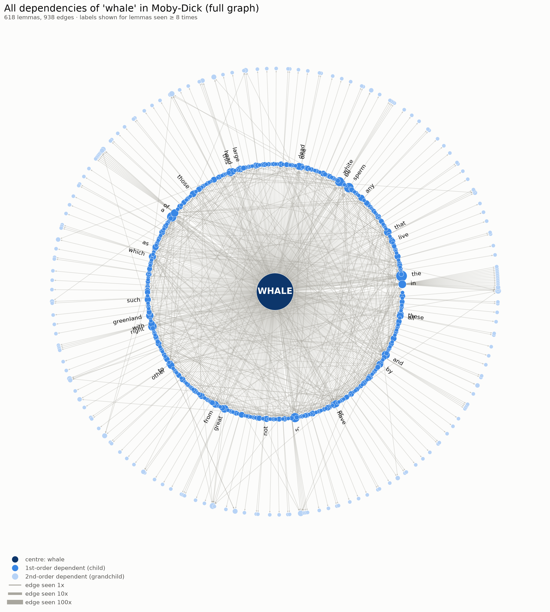
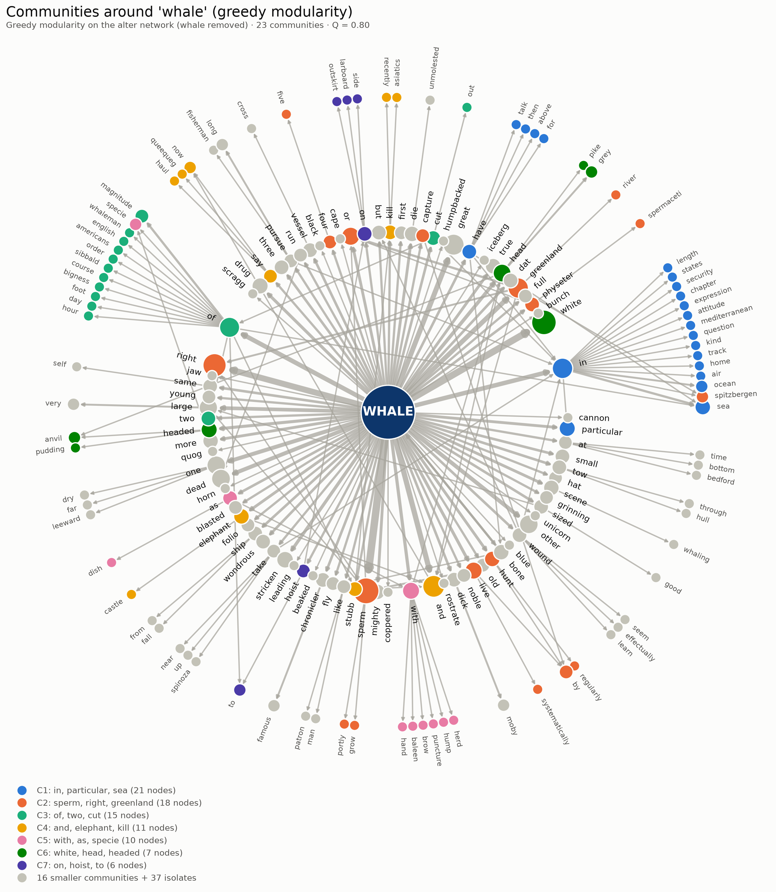
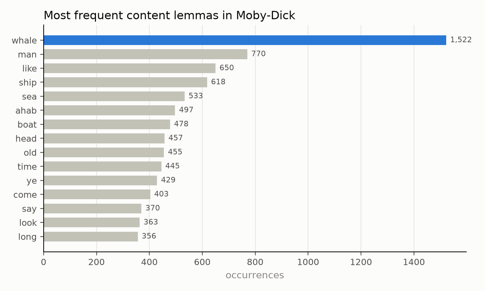
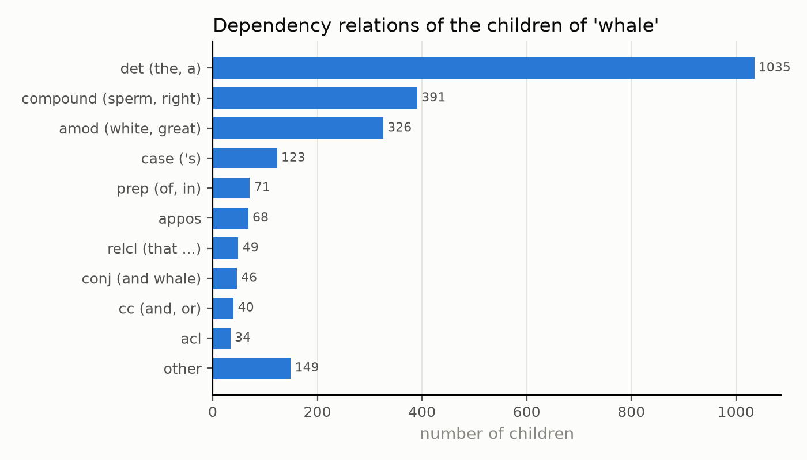
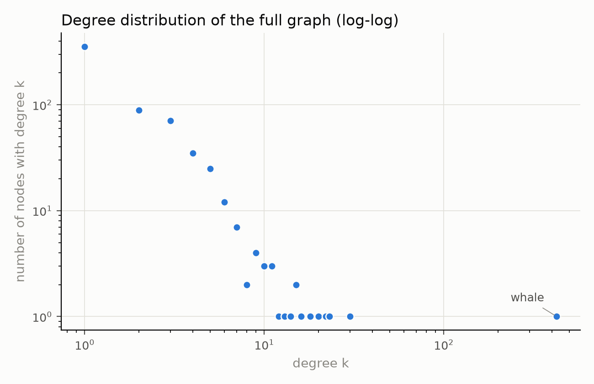

# HW1: the dependency network of *whale* in *Moby-Dick*

Assignment 1 for **Linguistic Data: Quantitative Analysis and Visualisation**
([task description](https://github.com/dashapopova/Linguistic-Data-Quantitative-Analysis-and-Visualisation/blob/main/assignments/HW1.md)).

**The full solution, with all code, output and explanations, is in [`HW1_moby_dick_whale_network.ipynb`](HW1_moby_dick_whale_network.ipynb).**

| File | Content |
|---|---|
| `HW1_moby_dick_whale_network.ipynb` | executed notebook (tasks 1–6) |
| `data/moby_dick.txt` | the novel: Herman Melville, *Moby-Dick* (1851), Project Gutenberg text |
| `data/moby_dick_lemmatized.txt` | the lemmatized novel (one paragraph per line) |
| `data/whale_dependencies.csv` | every extracted 1st- and 2nd-order dependency of *whale* |
| `data/whale_full_graph.gexf`, `data/whale_content_graph.gexf` | the graphs in GEXF format (open in Gephi) |
| `figures/` | all graphs (PNG) |

## Summary

1. **Novel:** *Moby-Dick*, 258,411 tokens, 2,793 paragraphs.
2. **Lemmatization:** spaCy `en_core_web_sm` (tagger + lemmatizer + dependency parser, one pass), as in the class notebook `LDQAV_SpaCy.ipynb`. Children are found with `token.children`, and one example sentence is shown with `displacy`.
3. **Word:** **whale** is the most frequent content lemma (1,522 occurrences). I extracted 2,332 children (426 distinct lemmas) and 627 grandchildren (315 distinct lemmas), skipping punctuation.
4. **Graph:** directed (head → dependent), radial layout. Node colour = dependency depth, node size = frequency, edge width = how often the head–dependent pair occurs.
5. **Network analysis:** the measures from the class notebook `LDQAV_graphs.ipynb`: density, diameter, average shortest path, connected components, assortativity, clustering and transitivity, degree / closeness / betweenness / eigenvector centrality, and communities with **greedy modularity** and **Girvan–Newman** (with and without the ego node). As extras I add a degree distribution, a k-core and a Louvain cross-check. The graphs are also saved as `.gexf` for Gephi.
6. **Conclusion:** *whale* is overwhelmingly a *modified* word: determiners 44%, species compounds 17% (*sperm, right, Greenland*), adjectives 14% (*white, great, dead*). The network is a sparse "star of stars" (density ≈ 0.005, almost no triangles). Its communities (Q ≈ 0.8 without the ego) separate zoological classification, location (*in the sea*), measurement (*of great magnitude*), anatomy (*with a hump*) and appearance (*white*). The densest core is made of hunting verbs (*pursue, take, wound*). This mirrors the novel's double nature: natural-history encyclopaedia and hunting story.

## Graphs

### Dependency graph of *whale*: content words (task 4)


| Parameter | Encodes | Why |
|---|---|---|
| directed edges | head → dependent | dependency relations are asymmetric |
| radial position | depth (centre / children / grandchildren) | the structure the task asks for |
| node colour | depth 0 / 1 / 2 (dark → light blue) | depth is ordered, so a one-hue sequential scale is used |
| node size | lemma frequency in the extracted relations (log) | shows the typical companions of *whale* without hiding the tail |
| edge width | number of times the pair occurs (log) | fixed collocations (*sperm whale*) stand out |

### The complete graph: all 618 dependencies, unfiltered (task 4)
The graph above leaves out determiners and rare words so that it stays readable. This one shows **every** child and grandchild. Only words seen at least 8 times are labelled.



### Communities (task 5)


### Supporting charts
| | |
|---|---|
|  |  |
|  | |

## Key numbers

| measure | full graph | content graph |
|---|---|---|
| nodes / edges | 618 / 938 | 174 / 214 |
| density (undirected) | 0.0049 | 0.0142 |
| transitivity | 0.010 | 0.023 |
| degree assortativity | −0.31 | −0.31 |
| greedy-modularity Q, with *whale* | 0.23 | 0.19 |
| greedy-modularity Q, alter network (without *whale*) | 0.75 | 0.80 |
| Girvan–Newman Q, alter network | – | 0.79 |

## Reproduce

```bash
pip install -r requirements.txt
jupyter nbconvert --to notebook --execute --inplace HW1_moby_dick_whale_network.ipynb
```
